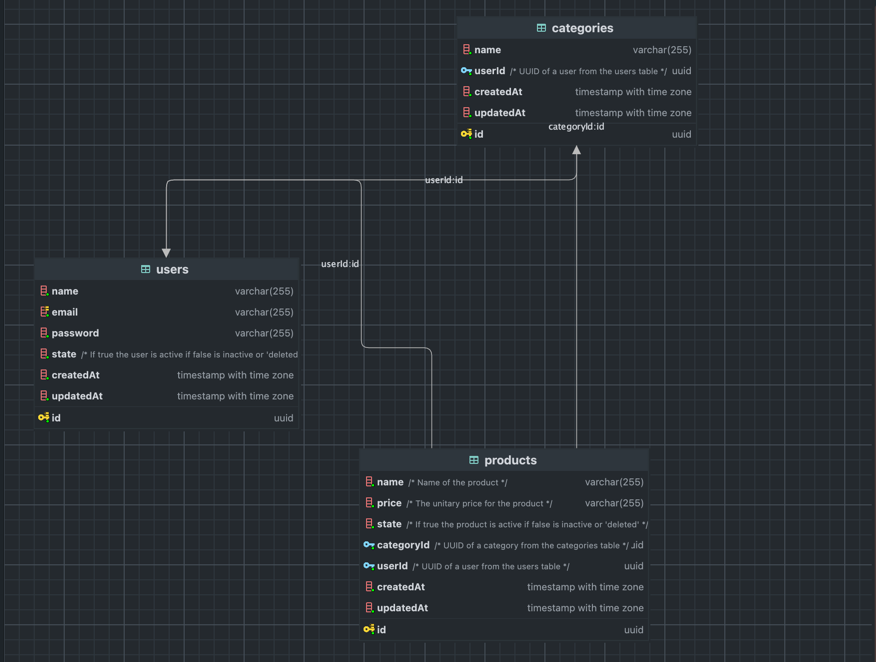

# mod_4

# How to start

* 1 clone this repository.
* 2 go to the repository folder and execute this command ```docker compose up -d db``` this will create a docker image
  with postgres.
* 3 in the root directory run the next command ```npm run watch```this will initiate nodemon and the express project.
* 4 use postman to verify the endpoints or a similar tool.

# API routes:

Application runs in port 5001 by default

## Unathenticated

    get: login: /api/login
    post: signup: login: /api/signup

## Users

    get: /api/users
    get: /api/users/:userId
    put: /api/users/:userId    
    delete: /api/users/:userId

## Categories

    get: /api/categories
    get: /api/categories/:categoryId
    get: /api/categories/:userId/categories-with-products
    post: /api/categories
    put: /api/categories/:categoryId    
    delete: /api/categories/:categoryId

## Products

    get: /api/products
    get: /api/products/:productId
    post: /api/products
    put: /api/products/:productId    
    delete: /api/products/:productId

# API POST examples:

create user: this is an unprotected route. is label as signup

```
{
    "name": "user test",
    "email": "test@test.com",
    "password": "some-password"
}
```

create category:

```
{
    "name": "category test",
    "userId": "uuid value"
}
```

create product:

```
{
    "name": "product test",
    "price": "20.5",
    "categoryId": "uuid value",
    "userId": "uuid value"
    
}
```

# UML Diagram

